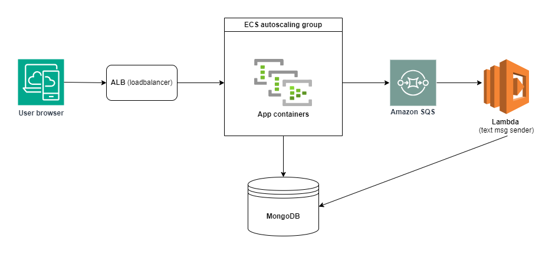

- **Project Introduction**
    
    This project is a full stack web application project that acts as a platform for SMS text marketing for small businesses. 
    
    Back-end is implemented by various REST APIs in nodeJS and frontend is implemented using AngularJS 1.x
    
    **Features:**
    
    - User login/registration
    - Upload contacts (customer phone numbers) via csv file
    - Create different groups based on marketing and promotion to run
    - Send message to particular group (of numbers). Text message sending is empowered using Twilio messaging API
    - Billing and subscription management using Braintree payments API
    
- **Architecture**

    
    The backend is transformed into scalable system using AWS services like ECS, SQS and Lambda and ALB.